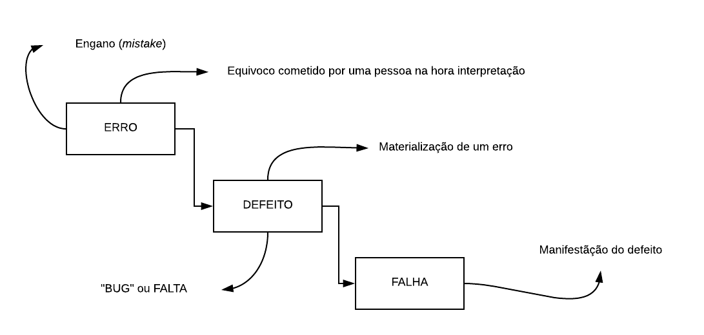
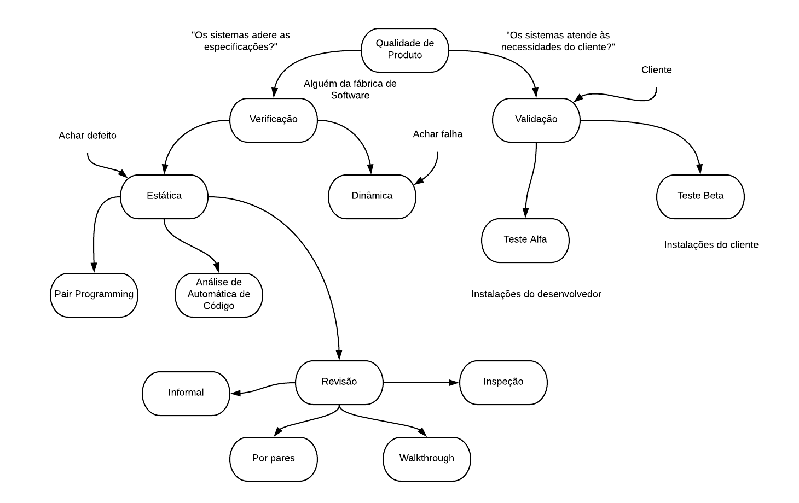

# Teste e Qualidade de Softwares

## O que é Qualidade de Software?

* Conformidade com especificações e padrões de desenvolvimento documentados
* Atendimento às necessidades dos usuários.

## Garantia da qualidade

* Técnicas que garantem que tanto o **processo** (desenvolvimento) quanto o **produto** (resultado final) estejam com a qualidade dentro de padrões pré-estabelecidos anteriormente

## Porque testar?

* Para se manter a qualidade
* Evitar falhas a hora de execução do software, que podem gerar desde de pequenos prejuízos, a prejuízos mais graves, como por exemplos morte ou perdas financeiras.

Link para saber mais:

* [Video do Nerdologia sobre os bugs mais incríveis da história](https://www.youtube.com/watch?v=t3v5r_SV4z0)

## Aula 27/08

### Notas:

* **Propagação de defeitos**: quando um defeito é passado de um insumo (artefato) para outro
* **Falha**: resultado observado que é diferente do resultado esperado. **Ocorre somente com o software em execução**.
* **Artefato**: é todo documento do projeto. Desde o caso de uso até o código fonte executável
* **Depuração != Teste**: é o ato de descobrir, inspecionar o código, em busca de falhas. Já o teste é a técnica de qualidade de software que visa buscar falhas no mesmo.

Diagrama que mostra a diferença entre os conceitos de Erro, Defeito e Falha

### Como definir qualidade de software

> Grau de aderência de um produto em relação às suas especificações e em relação às necessidades do cliente. Sendo assim, há duas perspectivas: o quão próximo o software está da **especificação** e da **necessidade do cliente**.

Diagrama que ilustra bem alguns conceitos que serão vistos na disciplina

### O que é teste?

### Porque testar?

### Princípios do teste

1. Teste demonstra a presença de defeitos não sua ausência
2. Teste exaustivo é impossível (inviável)
3. Teste antecipado (Modelo em V)
4. Agrupamento de defeitos (Princípio de Pareto)
5. Paradoxo do Pesticida
6. Teste depende do contexto
7. A ilusão da ausência de erros (Satisfação do cliente)

## Aula 03/09

### 3 Ps:

* **Processo**: receita de bolo. Sequencia de passos para um fim
* **Projeto**: empreendimento temporário, onde um equipe realiza o desenvolvimento de um produto ou serviço
* **Produto**: é o software em si

### Processo de Desenvolvimento de Software

* Um **processo** é composto por **atividades**, que são compostas por **tarefas** e esta por **passos**.

### Modelo em Cascata

* Criado em 1970
 
[Link](http://www.scf.usc.edu/~csci201/lectures/Lecture11/royce1970.pdf) para o primeiro texto sobre o processo

### Modelo em V

* Criado pelo Rook, pedido pelo Ministério da Defesa da Alemanha
* Ataca um dos problemas do cascata, que é evitar a propagação dos defeitos, ao descobrí-los cedo.
* Ao mesmo tempo que o software é construído, é planejado os testes

### Verificação e validação

* **Verificação**: feita pela equipe de desenvolvimento (testadores e programadores)
* **Validação**: feita pelo cliente ou seu representante

Imagem que ilustra tal diferença

### Dimensões do teste

Ao planejar o teste, é necessário estabelecer uma estratégia de teste. Tal estratégia, se baseia nas dimensões do teste

#### A abordagem bottom-up de teste

Se testa o software, começando das menores partes, para ***isolar*** os defeitos.

#### Tipos de teste

* Para se entender, leva-se em consideração os tipos de requisitos, funcionais e não-funcionais

#### Técnicas de teste

Leva-se em consideração o insumo que o testador terá. Se for ter acesso ao código fonte, é **teste baseado em estrutura** (*caixa branca*). Do contrário, tendo somente as especificações, é **teste de baseado em especificação** (*caixa preta*)

## Aula 24/09 - Entendendo as dimensões do teste

### Níveis de Teste

Os *níveis de teste* surgem no Modelo V. Inicialmente, os níveis de teste indicavam qual o nível do teste em relação à etapa de desenvolvimento. Atualmente, eles indicam a granularidade do item que está sendo testado.

* Testes de unidade
    * Desenvolvedor
    * Geralmente caixa branca
* Teste de integração
    * Desenvolvedor
* Teste de sistema
    * Equipe de teste
    * Foco no funcionamento do sistema como um todo
* Teste de aceitação
    * Cliente
    * Validar o software

### Tipos de Teste

* Funcional
    * Baseado nos requisitos funcionais
        * Casos de Uso
        * Regras de negócio
        * História de usuário
    * Pode ser usado desda especificação até a operação do sistema
* Usabilidade
    * Como medir a facilidade?
        * Lei de Nielsen-Norman: ***Usabilidade é quantificável***
    * São dependentes de ferramentas, mas não automatizáveis
    * Ferramentas
        * Morae (https://www.techsmith.com/morae.html)
        * Rastreamento de olhar:
            * Mapas de calor
            * Caminhos Sacádicos
    * Normas sobre Acessibilidade de Software: ISO/IEC 25010
        * Acessibilidade: é a usabilidade para pessoas com deficiência
    * Diretrizes
        WCAG e eMAG
* Desempenho
    * Capacidade de acesso concorrente
    * Tempo de resposta
    * Consumo de recursos
    * Quantidade de acessos concorrentes:
     * **Testes de Carga**: dentro das condições esperadas de carga, como seu sistema fica?
     * **Testes de Estresse**: impor uma carga acima do esperado
     * **Testes de Capacidade**: qual a capacidade do meu sistema?
     * **Testes de Resistência**: aplicar teste de carga continuamente, para ver até onde o sistema 
    * Quantidade de dados:
     * **Testes de Volume**: qual volume máximo de dados meu sistema suporta
* Contingência / Recuperação
    * Quanto tempo ocorre a recuperação após uma falha
    * Métrica: ***Tempo médio de Reparo (MTTR)***
    * [Acordo de Nível de Serviço](https://blog.deskmanager.com.br/acordo-de-nivel-de-servico/)
    * Verifica se sua política de contingência funciona
        * Documentar o Processo de Recuperação
* Segurança/Vulnerabilidade
    * Os meus dados estão protegidos?
    * Quais vulnerabilidades meu sistema está sujeito?
    * Ferramenta bem usada: OWASP ZAP
    * Ferramentas
        * Estáticos
            * SonarQube
            * PMD
            * Find Bugs
        * Dinâmicos
            * WebScarab
            * Kali Linux
            * Zed Attack Proxy
    * Orgão que definem diretrizes de segurança web
        * OWASP

### Técnicas de teste

* Baseada em Estrutura (caixa branca)
    * Insumo: código fonte
    * Superfície do software: código fonte
* Baseada em Especificação (caixa preta)
    * Insumo: documentação
    * Superfície: interface do usuário

#### O que teste exploratório?

Também conhecido como *Monkey Testing*, é quando o testador, de maneira bem simples e sem nenhum planejamento, fica testando de maneira aleatória o sistema (daí o termo *Monkey Testing*).

### Critério de Teste e Casos de Teste

> Em casos de teste para requisitos com range de valores é trabalhar nos limites

> Ao se testar, isole o requisito que se quer testar

* **Caso de teste**: dados de entrada + resultado esperado
* **Procedimento de teste**: são os passos para a execução de um ou mais caso(s) de teste

### Critérios de Seleção de Casos de Teste

* **Particionamento em Classes de Equivalência**: aplica-se a restrição de domínio (range de valores) no contexto de Banco de Dados.
* **Análise de Valor-Limite**: é uma melhoria do item anterior, que, em vez de escolher aleatoriamente um valor qualquer, se escolhe os valores limites na hora de testar
* **Tabela de Decisão**
* **Transição de Estados**: testa-se a partir do diagrama de máquina de estados
* **Array Ortogonal (todos-os-pares ou All Pairs)**:
    * Em vez de testar todas as combinações, eu testo pares delas
    * Para se colocar o indiferente, é necessário colocar um til com o valor do range `~`
    * Ferramentas:
        * http://www.satisfice.com/tools.shtml ou 
        * https://pairwise.teremokgames.com/

### Teste relacionado a mudanças

* **Teste de confirmação (resteste)**: eu testo o que havia falhado anteriormente
* **Teste de regressão**: garantir que defeitos corrigidos não tenham inseridos outros defeitos em outras partes do sistema. ***Restestar todo o sistema***. Ai surge a necessidade de se automatizar os testes
