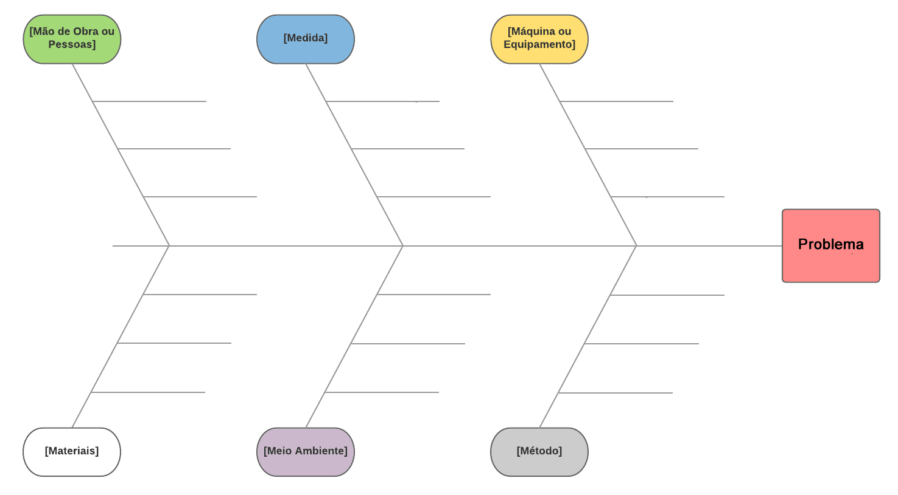

# Engenharia de Requisitos de Software

## O que é um processo?

É uma série de atividades inter-relacionadas com um objetivo em questão. **Todo processo começa e termina no cliente**. Um exemplo de processo é o atendimento em uma Petshop. Um outro exemplo de processo, é a criação de uma matrícula numa faculdade.

## O que é Modelar um Negócio Orientado a Processos?

É quando pensamos e buscamos entender um negócio como um conjunto de processos. Tal entendimento é eficaz, tendo em vista algumas questões colocadas no item (Porquê mapear processos é importante?)

A imagem a seguir mostra o cíclo de uma modelagem de negócios orientada a processos

http://blog.cigam.com.br/wp-content/uploads/2017/05/gestc3a3o-por-processos.png

## Organogramas versus Fluxogramas

+ **Organograma**: gráfico que mostra como está organizada a empresa.
+ **Fluxograma**: sequência de passos relativo a um processo.

## Como organizar processos?

## Porquê mapear processos é importante?

Toda empresa precisa entender seus processos, pois ao entender seus processos, se consegue melhorá-los e consequentemente, melhorar seu serviço.

Quando se cria um processo, e consequentemente, um fluxograma desse processo, é possível criar indicadores para o processo, para saber como está esse processo e poder medir para ver se está indo bem ou mal.

### Como é possível criar um indicador para esse processo?

**Todo fluxograma pode ter um ou mais lugares de decisão**. Por exemplo, imagine que existe um fluxograma para o atendimento de um cão na Petshop. Num determinado momento do atendimento, se verifica se o está presente um veterinário para atendê-lo. É possível, com isso, chegar a conclusão se estamos perdendo tempo e dinheiro na ausência do veterinário.

### Como mapear o processo?

Geralmente, para podermos mapearmos um processo, é necessário entrevistarmos o dono do processo, que é a pessoa responsável pelo mesmo. Tal pessoa compreende o processo e pode te dar inputs de como funciona esse processo, assim, fornecendo conteúdo para a criação do fluxograma / modelo do processo. Tal entrevista pode ser feita através de questionário ou entrevista pessoal.

### Ferramenta 5W2H

Essa ferramenta é um conjunto de 7 perguntas que podem nortear e ajudar no momento da entrevista, para mais informações, confira o link abaixo:

[https://endeavor.org.br/5w2h/](https://endeavor.org.br/5w2h/)

## Ferramentas para análise de problemas em processos

### Espinha de peixe ou Diagrama de Ishikawa ou de Causa e Efeito

Criada pelo [Engenheiro Kaoru Ishikawa](http://www.blogdaqualidade.com.br/gurus-da-qualidade-kaoru-ishikawa/). Sua criação se dá em torno de uma ideia básica: reunir pessoas diferentes, com olhares diferentes sobre o problema, para pensar sobre as causas do mesmo.

Este diagrama se propoe a afirmar que todo problema pode ter 6 tipos diferentes de causas, como ilustra a figura abaixo:

#### Como fazer?

1. Defina o problema
2. Crie o diagrama e marque o problema
3. Reuna a equipe
4. Analise as causas e fatores atrelados a estas e planeje ações

Fonte: https://www.citisystems.com.br/diagrama-de-causa-e-efeito-ishikawa-espinha-peixe/

### Diagrama de Pareto

Segundo o **Princípio de Pareto**, cerca de 80% dos problemas são causados por 20% dos problemas. Portanto, este diagrama auxilia na ordenação e na compreensão de que problemas são efetivamente urgentes.

Para mais informações, acesse: http://www.blogdaqualidade.com.br/diagrama-de-pareto/

### Matriz GUT

A matriz GUT é usada para priorização de problemas. Segundo [blog luz](https://blog.luz.vc/):

> A Matriz GUT é uma ferramenta de auxílio na priorização de resolução de problemas. A matriz serve para classificar cada problema que você julga pertinente para a sua empresa pela ótica da gravidade (do problema), da urgência (de resolução dele) e pela tendência (dele piorar com rapidez ou de forma lenta).

Os passos para a utilização dessa ferramenta são:

1. Elenque os problemas;
2. Defina qual, de 1 a 5, quais os valores para cada variável acima (Gravidade, Urgência e Tendência);
3. Multiplique os valores para cada linha;
4. Ranqueie os problemas pelos resultados encontrados.

Exemplo de uma matriz preenchida:

Para mais informações, acesse: https://blog.luz.vc/o-que-e/matriz-gut-gravidade-urgencia-e-tendencia/

## Orquestração e Coreografia

Segundo o Wikipedia, orquestração é a:

> composição de processos de negócio onde existe a figura de um processo central (processo mestre) que controla e coordena os demais processos. Neste tipo de composição, cada processo participante não tem conhecimento de que faz parte de uma composição de processos, com exceção do processo mestre.

Ainda segundo o Wikipedia, coreografia é:

> composição de processos de negócio onde não existe a figura de um processo mestre que controla e coordena os demais processos. Neste tipo de composição, cada processo envolvido tem o conhecimento de que faz parte de uma composição de processos e que precisa interagir com outros processos de maneira ordenada para que a composição resultante tenha sucesso.
