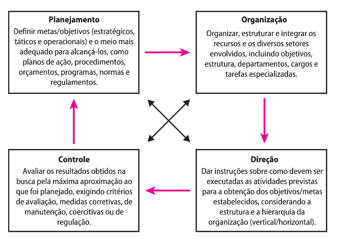
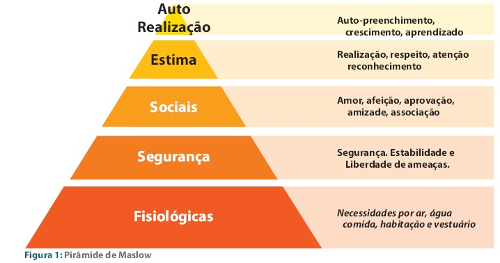
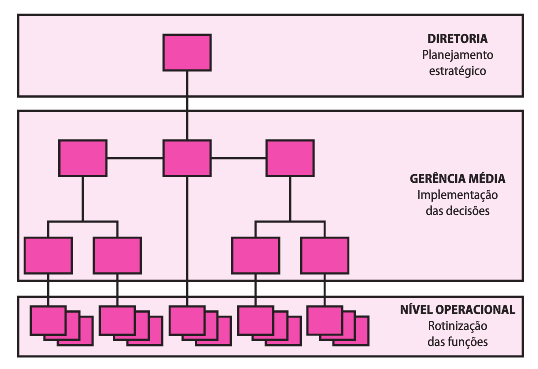

# Modelagem de Processos Organizacionais

- [Modelagem de Processos Organizacionais](#modelagem-de-processos-organizacionais)
  - [Teorias da Administração](#teorias-da-administracao)
    - [O que seriam sistemas abertos?](#o-que-seriam-sistemas-abertos)
    - [O que seria a Teoria Geral dos Sistemas?](#o-que-seria-a-teoria-geral-dos-sistemas)
    - [O que seria a Teoria sociotécnica?](#o-que-seria-a-teoria-sociotecnica)
    - [O que seria a Teoria da contingência?](#o-que-seria-a-teoria-da-contingencia)
    - [Teoria Científica da Administração](#teoria-cientifica-da-administracao)
    - [Teoria Clássica e neoclássica](#teoria-classica-e-neoclassica)
      - [Processo administrativo](#processo-administrativo)
      - [O que é organograma?](#o-que-e-organograma)
      - [Conceitos de linha e staff](#conceitos-de-linha-e-staff)
    - [Teoria das relações humanas](#teoria-das-relaces-humanas)
    - [Teorias comportamentais e de liderança](#teorias-comportamentais-e-de-lideranca)
      - [Hierarquia das necessidades humanas de Maslow](#hierarquia-das-necessidades-humanas-de-maslow)
      - [Teoria X](#teoria-x)
      - [Teoria Y](#teoria-y)
      - [Teoria dos dois fatores](#teoria-dos-dois-fatores)
    - [O que é burocracia?](#o-que-e-burocracia)
  - [A produção como ferramenta estratégica](#a-producao-como-ferramenta-estrategica)
    - [O que é estratégia?](#o-que-e-estrategia)
    - [Quais os níveis da estratégia?](#quais-os-niveis-da-estrategia)
    - [Quem afeta o estabelecimento de prioridades da produção](#quem-afeta-o-estabelecimento-de-prioridades-da-producao)
  - [Layout de produção](#layout-de-producao)
    - [O que é um layout de produção?](#o-que-e-um-layout-de-producao)
    - [Quais os tipos de arranjo físico?](#quais-os-tipos-de-arranjo-fisico)
    - [Quais os tipos de layout?](#quais-os-tipos-de-layout)
  - [Padronização do trabalho](#padronizacao-do-trabalho)
    - [Diferenças entre o takt time e o tempo de ciclo](#diferencas-entre-o-takt-time-e-o-tempo-de-ciclo)
  - [PDCA - Plan, Do, Check, Act](#pdca---plan--do--check--act)
    - [Ativos de uma organização](#ativos-de-uma-organizacao)
    - [O método PDCA](#o-metodo-pdca)
  - [Diagrama de Ishikawa](#diagrama-de-ishikawa)

## Teorias da Administração

Teorias da Administração contribuem para o modelo de gestão das mesmas. Organizações, no contexto atual, podem ser considerados sistemas abertos.

### O que seriam sistemas abertos?

Segundo Von Bertalanffy, um sistema aberto é como um complexo de elementos em interação e em intercâmbio contínuo com o ambiente.

### O que seria a Teoria Geral dos Sistemas?

A Teoria Geral dos sistemas é a tentativa de compreender os diversos sistemas científicos de maneira integrada. Ela se baseia nos seguintes pressupostos:

* Há uma tendência para a integração nas várias ciências naturais e sociais. • Tal integração parece orientar-se para uma teoria dos sistemas.
* Essa teoria pode ser ummeio importante de objetivar os campos não do conhe- cimento científico, especialmente nas ciências sociais.
* Desenvolvendo princípios unificadores que atravessam verticalmente os uni- versos particulares das diversas ciências, essa teoria aproxima-nos do objetivo da unidade da ciência.
* Isso pode levar a uma integração muito necessária na educação científica

A teoria geral dos sistemas, quando aplicado a Administração, entende que as empresas são organizações que, a partir de insumos, produzem produtos e / ou serviços, e, ao fazer essa produção, tem nela suas próprias organizações que se relacionam e cooperam para essa produção.

### O que seria a Teoria sociotécnica?

Ela pressupõe que a organização se divide em duas partes: a **técnica** e a **social**.

* **Técnica**: compreende o potencial de produção de uma organização. São as demandas da tarefa, são os equipamentos técnicos etc.
* **Social**: compreende as relações sociais dos próprios funcionários da empresa. *Elas transformam a eficiência potencial da empresa em eficiência real*.

### O que seria a Teoria da contingência?

Afirma que não há um modelo correto para uma organização. Que tal modelo nasce da relação da empresa com o ambiente externo. Ela se baseia nos seguintes pressupostos:

* A organização é um sistema aberto;
* As características organizacionais apresentam uma interação entre si e com o ambiente; 
* As características ambientais funcionam como variáveis independentes, enquanto as características organizacionais são variáveis dependentes.

Fontes:

* http://www.unicamp.br/fea/ortega/temas530/melissa.htm
* https://www.portaleducacao.com.br/conteudo/artigos/educacao/teoria-geral-dos-sistemas-e-os-sistemas-de-informacao/59309
* http://casadaconsultoria.com.br/teoria-contingencial/

### Teoria Científica da Administração

Tem com principal autor, Frederick Winslow Taylor. Este entendia que havia um desperdício de recursos e que existia uma forma correta de uma organização maximizar sua produção. Para isso, propôs o que ficou conhecido como **ORT - Organização Racional do Trabalho**. Os princípios da ORT são:

* Divisão clara entre quem comanda e quem executa (seleção científica do trabalhador)
* Uma ênfase na tarefa
* Padronização do trabalho e treinamento extensivo

Para a Administração Científica, o homem é um ser preguiçoso, que, no desejo de não passar fome, trabalha para ganhar seu sustento.

### Teoria Clássica e neoclássica

A teoria clássica foca em:

* Definição de **estrutura**
* Definição de **papéis**

Já a teoria neoclássica:

* Foco nos **objetivos** e nas **metas**

As principais características são:

* Divisão do trabalho
* Centralização das decisões
* Pequena amplitude de controle

#### Processo administrativo

Veja como, no diagrama abaixo, a teoria neoclássica entende o papel do gestor:

#### O que é organograma?

É como ocorre a especialização do trabalho na organização. Um organograma mostra a organização em diferentes **setores administrativos**.

#### Conceitos de linha e staff

Linha é a hierarquia da empresa bem como você se encontra nela (a quem comanda e quem te comanda). Já a *staff* é a acessoria prestada por terceiros. Na *staff* não ocorre a subordinação.

### Teoria das relações humanas

Segundo essa escola, o ser humano é enxergado como um *homos socialis*, ou seja, um ser dotado de sentimentos e temores, que procura ser aceito na sociedade em que está e procura também ter poder decisório. Uma outra definição é a de que o a eficiência do trabalho está ligada ao contexto social e não somente suas necessidades primárias.

### Teorias comportamentais e de liderança

Segundo esses movimentos, a administração de uma organização deve propor a **gerência participativa** e a **melhoria do clima de trabalho**.

#### Hierarquia das necessidades humanas de Maslow

Segundo Maslow, o ser humanno busca no trabalho a oportunidade de satisfazer suas necessidades, desde as mais básicas até a satisfação pessoal. Veja abaixo as categorias:

#### Teoria X

As pessoas são preguiçosas e indolentes, não querem trabalhar. Portanto, é necessário que a gestão tenha pulso firme e puna o trabalhador que não comprir com o acordado

#### Teoria Y

As pessoas gostam de trabalhar, e também veem no trabalho a possibilidade de crescimento pessoal. A tarefa da gestão é proporcionar esse ambiente de livre iniciativa do trabalhador.

As duas teorias anteriores são de Douglas McGregor

#### Teoria dos dois fatores

Segundo Herzberg, o ser humano, ao trabalhar, possui duas atitudes:

* Satisfazer sua necessidades básicas (**fatores higiênicos**)
* Aperfeiçoamento de suas habilidades, seu espírito e seu potencial humano (**fatores motivacionais**)

### O que é burocracia?

A interação entre os indivíduos deve seguir regras claras e padrões impessoais. O objetivo é evitar a arbitrariedade e organizar a atividade humana de maneira estável e que cumpra os fins propostos. Segundo essa lógica, a atividade humana deve seguir rotinas e procedimentos bem alinhados. Veja abaixo um quadro que ilustra bem essa situação:

Para um aprofundamento do conceito de burocracia, leia:

* [A racionalização do Direito: uma discussão sobre uma prova inusitada, a carta psicografada](http://egov.ufsc.br/portal/conteudo/racionaliza%C3%A7%C3%A3o-do-direito-uma-discuss%C3%A3o-sobre-uma-prova-inusitada-carta-psicografada)

## A produção como ferramenta estratégica

### O que é estratégia?

> A arte de alcançar resultados. Citando o conteúdo da faculdade, é um padrão geral para o alcance de objetivos.

### Quais os níveis da estratégia?

Existem três níveis primários de estratégia:

* Corporativo
* Comercial
* Funcional

A **estratégia corporativa** possui dus áreas de interesse:

* Os negócios que a corporação irá participar
* Aquisição de recursos

Já a **estratégia comercial** possui duas tarefas:

* Estabelecer os limites da empresa vinculando a parte corporativa com o comercial
* Estabele a base da empresa para uma vantagem competitiva

Por fim, **a estratégia funcional** deverá ser desenvolvida e seguida com o objetivo de sustentar a estratégia comercial

### Quem afeta o estabelecimento de prioridades da produção

* Consumidores
* Concorrentes
* Ciclo de vida do produto

## Layout de produção

### O que é um layout de produção?

> O layout de produção, também denominado arranjo físico, é uma representação gráfica do chão de fábrica. Mais do que uma planta, é uma técnica utilizada para definir a distribuição e disposição física dos componentes da área de produção. O objetivo é organizar o espaço físico do chão de fábrica localizando os equipamentos e postos de trabalho de forma a obter maior eficiência na produção.

> fonte: http://www.sispro.com.br/blog/o-que-e-layout-de-producao/

O que norteia a escolha de um layout de produção é o fluxo do processo de produção. Ou seja, a escolha de um layout se dá tendo em mente como será a produção do produto. Haverá vários produtos sendo feitos pelas máquinas? O produto se movimentará entre as máquinas/pessoas?

### Quais os tipos de arranjo físico?

* **Layout de projeto**: o produto permanece fixo, os recursos produtivos é que se descolam para construí-lo. Neste tipo de layout, é bem comum o alto uso do sequenciamento de tarefas. Exemplo de uso são a construção de embarcações, como iates, navios...
* **Centro de trabalho**: o produto se movimenta entre as diversas áreas de produção, cada qual responsável por uma operação na construção do produto.
* **Célula de produção**: é uma área dedicada em que são fabricados produtos semelhantes quanto aos requisitos de produção. São projetas para executar um grupo específico de tarefas e produzir um grupo específico de produtos.
* **Linha de montagem**: os processo de trabalho são organizados e ordenados de acordo com o progresso de construção do produto. Exemplo são as fábricas de brinquedos e eletrodomésticos

### Quais os tipos de layout?

* **Produto** ou **Linear**: o produto se movimenta entre as estações de trabalho e estas vão finalizando processos de produção ou adicionando peças. A ordem já é pré-estabelecida dentro do processo produtivo. A principal vantagem é o baixo custo unitário do produto, assim como baixo custo para treinamento de mão-de-obra. A principal desvatagem é a facilidade de se ter gargalos. A falta de flexibilidade, baixo uso de reaproveitamento de máquinas e mão-de-obra
* **Processo** ou **Funcional**: o produto se movimenta entre as estações, mas não há a produção somente de um produto, mas mais de um, com fluxo diferentes. Tem-se como vantagem a flexibilidade e portanto, seu uso é interessante quando a produção é intermitente.
* **Fixo** ou **Posicional**: o produto permanece fixo, sendo que as os recursos produtivos, como máquinas e pessoas se movimentam para criar o produto. Uma característica interessante é que os produtos são únicos e não repetitivos.
* **Celular**: todo processo de fabricação fica dentro de uma estação (célula) de trabalho, que é responsável pela produção de um ou mais produtos. O exemplo de uso é uma Loja de Departamentos.

Fonte importante: https://www.pciconcursos.com.br/aulas/administracao-geral/17-layout-da-producao-e-instalacao-arranjo-fisico-e-fluxo a partir do tempo 11:30

Playlist de consulta: https://www.pciconcursos.com.br/aulas/administracao-geral/

## Padronização do trabalho

Porque padronizar os processos?

* aumento do tempo produtivo
* redução de falhas
* regulamentação das funções

Segundo Monden, a padronização do trabalho inclui:

* **Tempo takt**: tempo máximo que uma unidade do produto deve levar para ser produzida, ditado pela demanda do produto
* **Rotina-padrão**: é um conjunto de operações executadas por um operador em uma sequência determinada, permitindo-lhe repetir o ciclo de forma consistente ao longo do tempo.
* **Estoque padrão em processo**: estoque necessário para que a produção se mantenha constante

Ainda segundo Mondem, com a padronização, temos 3 objetivos:

1. Obter alta produtividade
2. Obter balanceamento entre os diferentes processos produtivos, usando o conceito de *takt time*
3. Somente uma quantidade mínima de material é consumida e manipulada durante o processo

Segundo Spear e Bowen, as empresas precisam seguir 4 regras para ter sua padronização do trabalho:

1. Todo trabalho deve ser altamente especificado quanto ao conteúdo, sequencia, andamento e resultado
2. Cada conexão entre cliente-fornecedor deve ser direta
3. O caminho para cada produto ou serviço deve ser simples e direto
4. Qualquer melhoria deve ser feita de acordo com o método científico

### Diferenças entre o takt time e o tempo de ciclo

* **Takt time**: ritmo de produção necessário para atender a um determinado nível de demanda
* **Tempo de ciclo**: tempo de execução da operação em um posto de trabalho

## PDCA - Plan, Do, Check, Act

### Ativos de uma organização

* **Ativos de capital**: direcionado pelo mercado pela realização de investimentos diretos feitos pelos acionistas ou proprietários. Está relacionado com a capacidade de acumular tecnologias, equipamentos e instalações.
* **Ativos de conhecimento**: é a agregação de conhecimento e crescimento intelectual dos colaboradores da organização. Está relacionado às pessoas.

Uma empresa, para se tornar competitiva, não pode menosprezar o poder dos ativos de conhecimentos.

Segundo Falconi, alguns fatores indispensáveis para a acumulação de conhecimento:

* **Tempo**: a curva de aprendizagem de cada pessoa é diferente
* **Metas**: é importante ter objetivos na aprendizagem
* **Cultura**: é importante que haja uma cultura de insatisfação, busca de inovação

### O método PDCA

Este método não é usado somente para a busca de resultados, mas também para mantê-los.

* **Plan**: planejar metas e como alcançá-las
* **Do**: é a execução do que foi planejado
* **Check**: a partir do que foi feito, encontra-se pontos de melhorias. É a reflexão do que foi feito
* **Act**: é quando se coloca em prática as correções

A seguir, uma imagem mostrando o diagrama PDCA:

## Diagrama de Ishikawa

Veja o link a seguir: http://www.portal-administracao.com/2014/08/diagrama-de-ishikawa-causa-e-efeito.html
