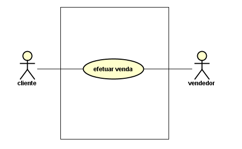
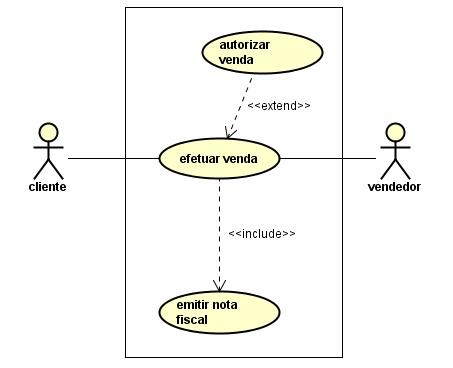

# Analise e Projeto Orientados a Objeto

## Processo de desenvolvimento de software

+ **Análise**: consiste em levantar os requisitos do sistema proposto com o objetivo de entender o seu funcionamento.
+ **Projeto**: considera os aspectos lógicos e independentes de implementação. Nesta fase, determina-se como o sistema funcionará. Como artefatos são produzidos diagramas de casos de uso, diagramas de classes entre outros.
+ **Implementação**: é a fase de codificação utilizando linguagem de programação.
+ **Testes**: nesta etapa são realizados testes para verificação / detecção de erros.
+ **Implantação**: o sistema é impacotado, distribuído e instalado no ambiente do usuário.

## Requisitos

É uma condição ou uma necessidade que o sistema se propõe. Podem ser do tipo:

+ **Requisitos funcionais**: definem as funcionalidades a serem desenvolvidas do sistema. Exemplo:
> O sistema deve permitir lançar nota pelo professor.

+ **Requisitos não-funcionais**: declaram as características de qualidade que o sistema deve possuir e que estão relacionadas às suas funcionalidades. Exemplo:
> Confiabilidade, desempenho, segurança...

## Diagrama de Casos de Uso

> Um caso de uso representa quem faz o que (interage) com o sistema, sem considerar o comportamento interno do sistema

Em suma, o diagrama de Casos de Uso ilustra os requisitos funcionais do sistema, sem levar em conta como isso será implementado no sistema.

#### Conceitos importantes:

+ **Elipse**: representa o caso de uso, ou seja, as funções/funcionalidades do sistema.
+ **Fronteira**: retangulo que demarca o espaço do sistema em relação ao espaço não participante do sistema.
+ **Ator**: pesssoa/sistema que interage com o sistema.
+ **Setas/Linhas**: representam os relacionamentos entre atores/funcionalidades
  + Ator primário: é o que dispara o caso de uso. Que interaje diretamente com o caso de uso.
  + Ator secundário: é que auxilia o ator primário na execução do caso de uso. Não interaje diretamente com o caso de uso.

#### Estereótipos - ocorre entre casos de uso:

+ Include: representa um relacionamento obrigatório. Exemplo: ao executar o caso de uso `efetuar venda`, obrigatoriamente será executado o caso de uso `emitir nota fiscal`.

+ Extend: representa um relacionamento não obrigatório. Exemplo: para ser executado o caso de uso `efetuar venda`, não é obrigatório executar o caso de uso `autorizar venda`.

Exemplo:

## Diagrama de Classes

Um Diagrama de Classes é um diagrama do tipo estático que define quais as entidades em seus sistema bem como o relacionamento entre elas.

Podemos visualizar o diagrama de classes que nos fornece as seguintes perspectivas:

+ **Conceitual**, pois fornece os principais conceitos do sistema, bem como os domínios do mesmo.
+ **Especificação**, pois oferece a possibilidade de compreender os métodos do sistema, sem fornecer como os mesmos irão ser implementados.
+ **Implementação**, pois fornece os principais detalhes de implementação do sistema, como visibilidade e tipos de atributos das classes.

#### Principais conceitos:

+ **Classes**: são as abstrações das entidades. Podemos fazer paralelo com as entidades de um Modelo Entidade-Relacionamento(EE).
+ **Relacionamentos**: são as associações entre as classes. Novamente, é possível fazer paralelo com o Modelo EE.

A seguir, uma imagem com os principais conceitos:

